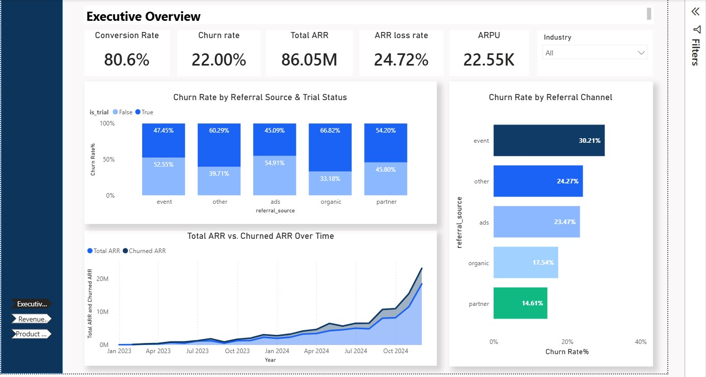
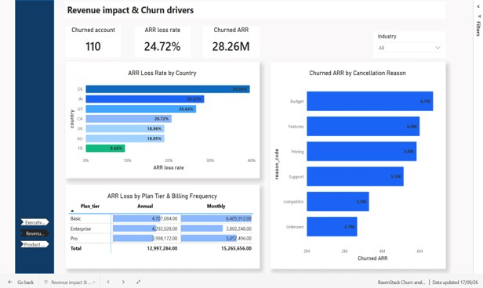
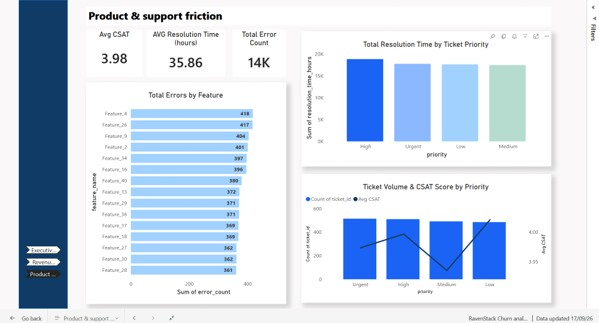

**Churn Analysis: RavenStack startup (SQL and Power BI)**

An end-to-end data analytics project to build churn analysis for RavenStack using SQL queries for data cleaning and EDA and an interactive Power BI dashboard for analytics and visualization. This analysis answers a main business question: What causes customer churn? Where do the operational failures occur: from lead acquisition to product experience?

**Project overview:** 
**Case study:** RavenStack is a stealth-mode SaaS startup that delivers an AI collaboration tool for teams and the tool provides basic, pro, and enterprise subscription plans. 

**Business context/ problem:** RavenStack piloted its platform and collected detailed data on every sign-up, feature interaction, support ticket, and cancellation. Before scaling and public launch, leadership needs to evaluate these pilot results to understand customer churn patterns and where failures occur.

**Analytical Approach:** This project combines a structure of two layers:
•	SQL Layer: Cleans raw customer tables, validates relationships, and executes exploratory data analysis (EDA) to calculate churn baseline.
•	Power BI Layer: Transforms SQL outputs into an interactive 3-page executive dashboard to highlight revenue risk and operational failure points for leadership.

**Data source:** The dataset used for this project is [RavenStack: Synthetic SaaS Dataset](https://www.kaggle.com/datasets/rivalytics/saas-subscription-and-churn-analytics-dataset) published on Kaggle
•	Author: River @ Rivalytics.
•	Tables and scope: accounts (500); subscriptions (5,000); feature usage (25,000); support tickets (2,000); churn events (600)

**SQL Analysis**

**Tool:** SQL Server Management Studio 

**File:** [`Customer_Churn_Queries.sql`](Customer_Churn_Queries.sql)  

**Analysis steps:**
I extracted, linked, cleaned and explored the raw data in SQL Server to validate data and explore initial patterns:

•	**Linking tables:** I set up primary key (PK) and foreign key (FK) relationships across accounts, subscriptions, feature_usage, support_tickets, and churn_events tables. I added a unique ID to the feature_usage table to clean up duplicate records. 

•	**Data cleaning:** I fixed data types for currency fields, checked all five tables for duplicate rows using CTEs, filled in missing feedback text with 'No feedback provided', and cleaned up inconsistent spacing and capital letters across category names.

•	**Multi-Table Integration and Analysis:** Including joining data across the customer journey. I used LEFT JOIN queries: one to merge account information, subscription revenues and churn records and another to link the account and support tickets tables to create a single, clear view of the customer life cycle

•	**Exploratory Data Analysis (EDA):** I used SELECT, COUNT, SUM, AVG, GROUP BY, and ORDER BY statements to measure baseline conversion rate and total refund amounts by churn reason, and evaluate ticket volumes, resolution times, and customer satisfaction scores across ticket priority levels. 
 

**Power BI dashboard**

**Tool:** Power BI Desktop

**Pages:** 3

**Data model:** Star-schema style relationship between 5 tables: accounts, subscriptions, feature usage, support tickets, churn events, with 10 custom DAX measures.

**Page 1: Executive Overview: acquisition leak** 
Track revenue leakage across acquisition channels (referral sources) by examining core performance indicators using custom DAX measures: Conversion Rate (80.60%), Total ARR ($86.05M), ARR Loss Rate (24.72%), ARPU ($22.55K), and Churn Rate (22.00%)—to define revenue leakage across acquisition channels. 
•	Main question: Where in the sales funnel is the startup losing revenue, and which customer acquisition channels bring in the highest-risk accounts?

 

**Page 2: Revenue impact & Churn drivers: financial bleed**

Monitor the financial impact of churning across plans (basic, pro and enterprise), countries, and cancellation feedback.
•	Main question: How much money ($ ARR) is this startup losing, which customer plan tiers and geographic markets are bleeding the most, and what reasons are customers giving when they cancel?
 
 
 
**Page 3: Product & support friction: operational root cause**
Investigate technical support delays that lead customers to cancel.

•	Main question: which specific features are breaking, how are those product defects impacting customer support response times and CSAT, and what operational fixes will stop the churn?
 
  

**Key business insights and recommendations:**

**•	Good conversion, but there is significant churn in the middle of the lifecycle:** While RavenStack’s customer conversion performs well with an 80.60% trial conversion rate, RavenStack is experiencing a 22.00% churn rate and a 24.72% ARR loss rate. Customers are signing up, but they are leaving during active paid usage.

**o	Action:** Add early onboarding checks to catch struggling trial users before they cancel. 

**•	Event and ad channels bring in the highest-risk customers:** event referrals produce the highest churn rate (around 30%), followed by ‘other’ and ads channels. In contrast, organic and partner sign-ups exhibit lower churn rates.

**o	Action:** shift acquisition strategy from high-churn event and ad campaigns toward organic and partner channels.  

**•	Technical errors are driving support overloads:** a total of 14K errors were logged across features, with Feature_4, Feature_26, Feature_9, and Feature_2 generating over 1,600 errors combined.

**o	Action:** Adress top error in Feature_4, Feature_26, Feature_9, and Feature_2 to remove over 1,600 system errors.  

**•	Response times for support are delayed across all plan tiers:** resolution times average 35.86 hours regardless of whether a ticket is flagged as urgent, high, or low priority. This leaves high-value customers waiting when major errors occur, which leads to a drop in overall satisfaction to 3.98 CSAT.

**o	Action:** implement strict rules to resolve urgent and high-priority tickets first.

**Technical challenges:**

**•	Adding auto_feature_id:** Setting usage_id as the primary key failed because SQL Server flagged 21 duplicate IDs. However, these weren't duplicate rows; they were separate user actions from different subscriptions that accidentally shared the same ID  (due to a data-generation bug).

o	Deleting these rows would have removed usage times and error records needed for churn analysis. Instead, I added a brand-new auto-incrementing column (auto_feature_id) to serve as a primary key without losing any underlying data. I used AI as a coding assistant to research standard SQL techniques for handling duplicate IDs with unique rows

**•	Fix relationship issues in Power BI:** The churn reasons chart on Page 2 showed identical, flat numbers across every bar because Power BI wasn't passing filters between tables. Cancellation reasons are in the churn_events table, while revenue data is in the subscriptions table. Because the relationship was one-way (and inactive), selecting a cancellation reason couldn't filter the revenue metrics.

o	In Power BI's Model View, I set the cross-filter direction between churn_events[account_id] and subscriptions[account_id] to Both and activated the relationship. This allowed cancellation reasons to properly filter subscription ARR and reveal the true revenue loss per reason. AI was used to double-check how filters flow between tables against target DAX patterns

**License:** Permissive MIT-like License (Synthetic dataset, educational/portfolio use with attribution)

